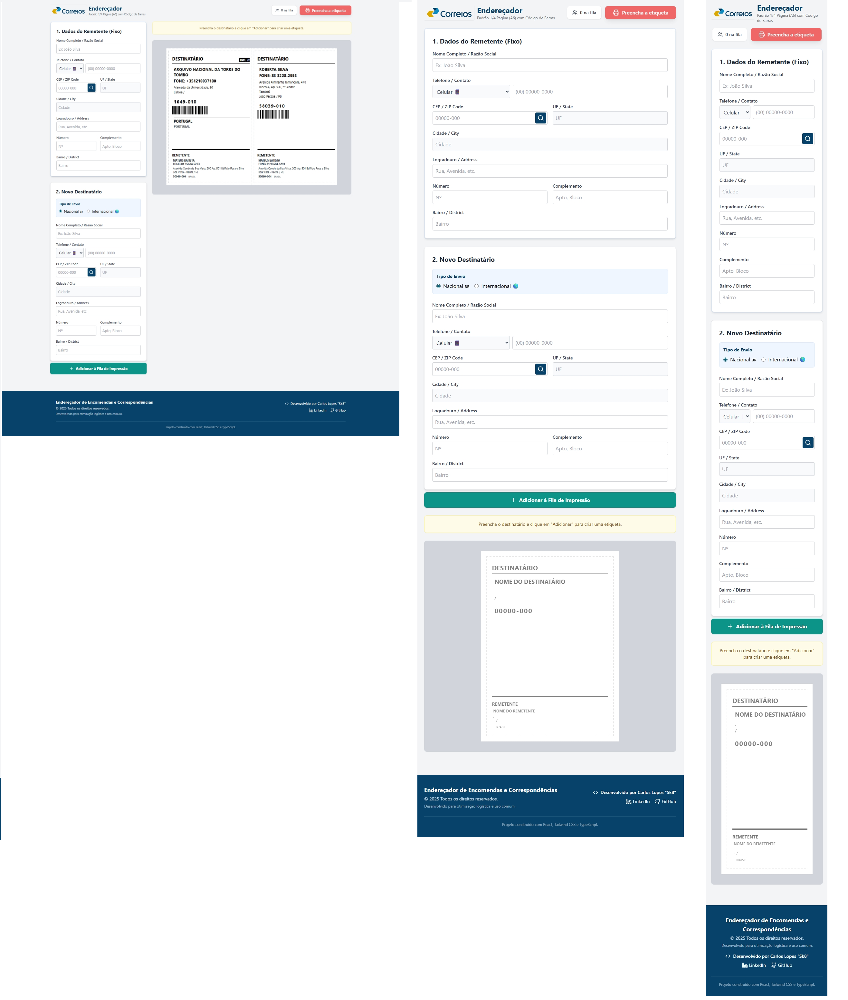
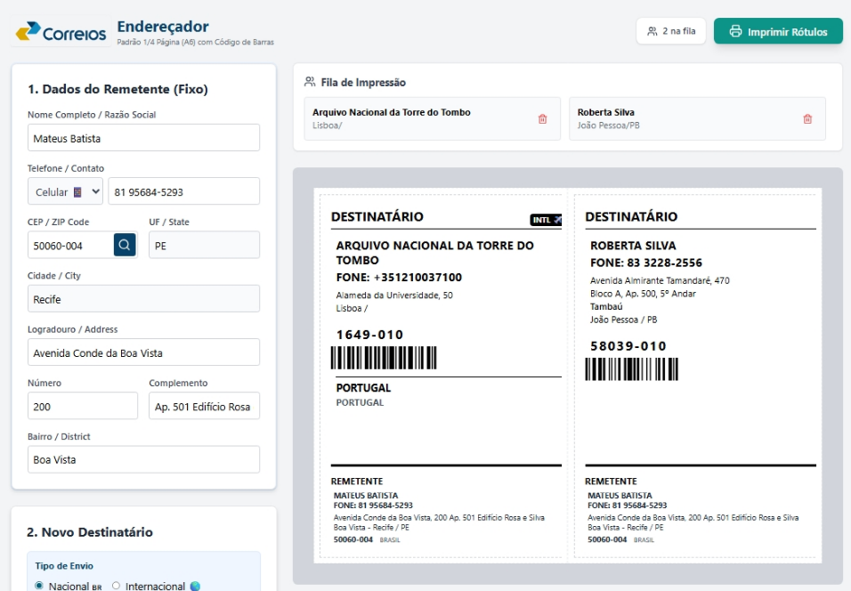
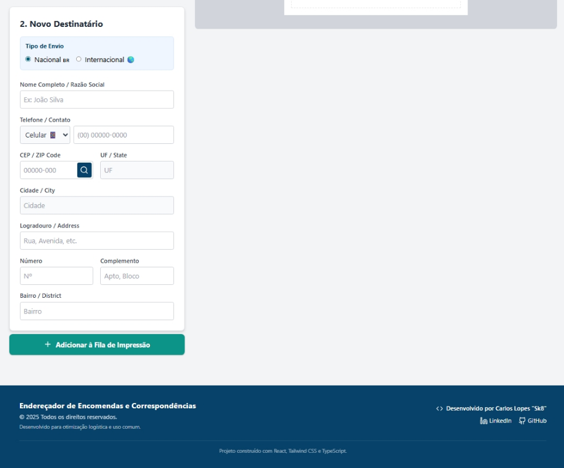

# <a href="https://reactjs.org/" target="_blank" rel="noreferrer"> </a><a href="https://tailwindcss.com/" target="_blank" rel="noreferrer"> </a><a href="https://www.typescriptlang.org/" target="_blank" rel="noreferrer"> </a> Endereçador
___
# 📦 Endereçador de Encomendas e Correspondência


> Aplicação web single page responsiva para busca de CEP, geração e preenchimento automatizado de etiquetas de endereçamento de encomendas.

## 🎯 Preview

| Desktop, Tablet e Mobile |
|---------------------------|
|  |

### 💻 Interface Desktop

| Desktop | Remetente e Visualização da Impressão | Destinatário e Footer |
|---------------------------|-----------------------------------|-------------------|
|  |  |  |

### 📱 Interface Mobile

| Remetente Mobile  | Destinatário Mobile | Preview de Impressão e Footer Mobile|
|--------------------------------|------------------------|----------------------|
|  |  |  |

## ✨ Sobre o Projeto

O **Endereçador** é uma Single Page Application (SPA) robusta desenvolvida para resolver o problema da geração manual de etiquetas de postagem. <br /> A aplicação automatiza o preenchimento de endereços utilizando a API ViaCEP, gera códigos de barras (Code 128) para rastreio automatizado e suporta envios internacionais com tradução de campos e seleção de países. <br /> O sistema permite criar lotes de etiquetas para múltiplos destinatários mantendo o mesmo remetente. <br /> A aplicação foi feita utilizando como modelo as etiquetas dos Correios do Brasil, focando em agilidade logística e padronização de envios de encomendas nacionais e internacionais. 

## 🛠️ Stack Tecnológica

### Frontend

- **React** - Biblioteca principal de UI
- **TypeScript** - Tipagem estática e segurança de código
- **Tailwind CSS** - Estilização utilitária e responsividade
- **Vite** - Build tool de alta performance

### Bibliotecas

- **React-to-print** - Gerenciamento de impressão e renderização de componentes
- **React-barcode** - Geração de códigos de barras (Code 128)
- **Lucide React** - Ícones vetoriais modernos
- **Clsx** - Construção condicional de classes CSS

### Ferramentas:

- <a href="https://viacep.com.br/" target="_blank" rel="noreferrer">   ViaCEP - API de consulta de endereços brasileiros</a><br />
- <a href="netlify.com" target="_blank" rel="noreferrer">   Netlify - Hospedagem e CI/CD</a><br />
- <a href="fonts.google.com" target="_blank" rel="noreferrer">   Google Fonts - Tipografia (Inter/Roboto)</a><br />
-  Google AI Tools - Assistência de Desenvolvimento <br />
    1 - <a href="https://aistudio.google.com/app" target="_blank" rel="noreferrer">Google AI Studio - Vibe Coding e Refinamento de Código</a><br />

## 🚀 Funcionalidades

### Core Features

- ✅ **Busca Automática de CEP**: Integração com ViaCEP para preenchimento rápido.
- ✅ **Geração de Código de Barras**: Facilita a triagem automatizada nos Correios.
- ✅ **Modo Internacional**: Suporte a envios para o exterior com base de dados de países e tradução (PT/EN).
- ✅ **Impressão em Lote**: Adicione múltiplos destinatários e imprima tudo de uma vez (Grid 2x2 em A4).
- ✅ **Design Print-Friendly**: Layout otimizado para economia de tinta e leitura por scanners.
- ✅ **Identificação de Contato**: Suporte visual para telefone Fixo ☎️ ou Celular 📱.

## 🎨 Design System & UX/UI

- **Identidade Visual**: Cor primária `#07426B` (Azul Naval) transmitindo confiança e profissionalismo.
- **Feedback Visual**: Botões interativos com estados de *hover*, *disabled* e *active* (Teal/Red).
- **Tipografia**: Fontes sem serifa para máxima legibilidade na impressão.
- **Acessibilidade**: Campos com labels claros, foco visível e ícones de suporte.

## ⚠️ SEO & Performance

- ✅ Aplicação Client-Side leve e rápida (Vite).
- ✅ Sem dependência de banco de dados (Dados voláteis para privacidade).
- ✅ Estilização atômica (Tailwind) para menor CSS bundle size.

## 📊 Status do Projeto - **Concluído** ✅

**Hospedagem**: Netlify  
**Site de Produção**: [Acesse o Endereçador Aqui](https://enderecador.netlify.app/).

## 📞 Contato

Desenvolvido por **Carlos Lopes "Sk8"** <br/>
[](https://www.linkedin.com/in/carlos-lopes-b445aa201)
[](https://github.com/CHCLopes)

## 📦 Instalação e Desenvolvimento

```bash
# Clone o repositório
git clone https://github.com/CHCLopes/ProjetoEnderecador

# Instale as dependências
npm install

# Execute em modo desenvolvimento
npm run dev

# Build para produção
npm run build
